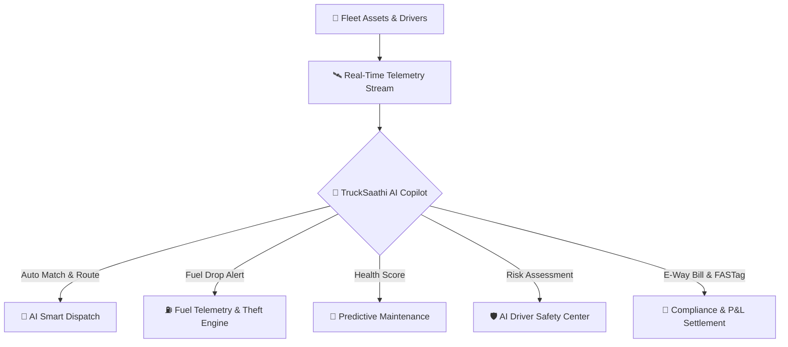

<div align="center">

  <br />

  ```
   _____              _     _____                 _  _   _ 
  |_   _|            | |   /  ___|               | || | | |
    | |_ __ _   _ ___| | __\ `--.  __ _  __ _ _| || |_| |
    | | '__| | | / __| |/ / `--. \/ _` |/ _` |_  ..  _  |
    | | |  | |_| \__ \   < /\__/ / (_| | (_| |_  || | | |
    \_/_|   \__,_|___/_|\_\\____/ \__,_|\__,_| |_||_| |_|
  ```

  ### 🚚 **TruckSaathi Enterprise Fleet Copilot**
  *The Next-Generation AI-Powered Logistics & Commercial Telemetry Platform for Pan-India Freight Control.*

  [](https://nextjs.org/)
  [](https://www.typescriptlang.org/)
  [](https://tailwindcss.com/)
  [](https://www.framer.com/motion/)
  [](LICENSE)

  <p align="center">
    <a href="#-key-features">Key Features</a> •
    <a href="#-architecture--tech-stack">Tech Stack</a> •
    <a href="#-system-modules">System Modules</a> •
    <a href="#-getting-started">Getting Started</a> •
    <a href="#-india-compliance-engine">India Compliance</a>
  </p>

  ---

</div>

<br />

## 🌟 Overview

**TruckSaathi** is a state-of-the-art, hyper-modern AI enterprise fleet copilot engineered to unify fragmented commercial vehicle operations across India. By bridging isolated vehicle telemetry, driver analytics, compliance databases, and financial trip settlements into a single real-time glassmorphism control tower, TruckSaathi optimizes fleet efficiency, prevents fuel theft, eliminates breakdown downtime, and ensures 100% legal compliance.

---

## ⚡ Key Features & Capabilities



- 🤖 **AI Smart Dispatch Engine:** Machine learning vehicle-driver pairing that evaluates payload capacity vs. cargo weight, driver safety scores, and vehicle maintenance health to output 95%+ match scores and optimized highway route corridors.
- ⛽ **Fuel Telemetry & Theft Analytics:** Real-time tank capacity tracking (liters & %), distance efficiency metrics (KMPL), refuel logging, and instant critical alerts for sudden nocturnal fuel drops.
- 🧾 **Financial Settlement & Trip P&L:** Complete commercial trip revenue accounting — tracking Gross Freight Income, FASTag Toll Spend, Fuel Costs, Driver Allowances, Net Profit, and Profit Margin percentages per trip.
- 🔧 **Predictive Maintenance:** Subsystem component health monitoring (Brakes, Battery, Engine, Tyre Tread Wear) with automated service urgency scoring and workshop bay prognosis.
- 🛡️ **AI Safety Center:** Telemetry event monitoring including overspeeding, harsh braking, rapid acceleration, fatigue alerts, and seatbelt compliance with driver safety rank leaderboards.
- 📱 **Mobile Driver Field Portal:** Driver-facing field app for viewing trip manifests, uploading digital Proof of Delivery (POD) bills, and triggering emergency highway SOS panic alerts.
- 🇮🇳 **India-Specific Compliance Vault:** Integrated E-Way Bill status tracking (Compliant / Expiring Soon / Expired), FASTag toll auto-deduction, and cargo overloading prevention warnings.
- 🪟 **Centered Pop-Up Modal System:** Fluid glassmorphism modals for detailed trip manifests, vehicle telemetry, driver profiles, and notifications with smooth backdrop blur overlays.

---

## 🛠 Architecture & Tech Stack

| Component | Technology | Description |
| :--- | :--- | :--- |
| **Framework** | **Next.js 16 (App Router)** | High-performance React framework with Turbopack bundler |
| **Language** | **TypeScript 5.0** | Strict type-safe schema modeling for vehicles, trips, drivers, and telemetry |
| **Styling & UI** | **Vanilla CSS + TailwindCSS** | Bespoke HSL dark mode, neon glow tokens, and glassmorphism styling |
| **Animation** | **Framer Motion** | 60 FPS page transitions, card tilts, modal zoom-in animations, and counters |
| **Iconography** | **Lucide React** | Clean, modern vector icon set tailored for industrial telemetry |
| **Export Engine**| **JS CSV Utility** | Zero-dependency high-speed data stream exporter for CSV reporting |

---

## 📊 System Modules & Routes

| Route | Feature Module | Core Functionality |
| :--- | :--- | :--- |
| `/dashboard` | **Telemetry Control Center** | Live Pan-India map telemetry, active fleet status, total revenue & safety KPIs |
| `/trips` | **Trips & Dispatch** | Trip creation, cargo overloading alerts, E-Way Bill badges, & POD verification modal |
| `/ai-dispatch` | **AI Smart Dispatch** | One-click auto-dispatch engine with vehicle-driver AI matching scores |
| `/vehicles` | **Asset Registry** | Commercial fleet vehicle database, chassis/engine serials, RC & Insurance vault |
| `/maintenance` | **Predictive Maintenance** | Component health wear progress bars (Brakes, Battery, Engine, Tyres) & service dates |
| `/fuel` | **Fuel Telemetry** | KMPL efficiency analytics, tank level monitoring, refuel logs, & fuel theft alert card |
| `/expenses` | **Trip Expenses & P&L** | Commercial trip revenue vs expense breakdown, FASTag tolls, & net margin badges |
| `/drivers` | **Human Capital** | Driver directory, license verification, contact details, & assigned vehicle status |
| `/safety` | **AI Safety Center** | Fleet safety index KPI, safety event cards, risk breakdown, & driver leaderboard |
| `/driver-portal` | **Mobile Field Portal** | Mobile-optimized driver interface for trip manifests, POD scanner, & highway SOS |
| `/reports` | **Reporting & Exports** | Generated report history log & modal exporter (Vehicle, Driver, Trip datasets) |

---

## 🇮🇳 India-Specific Logistics Compliance

TruckSaathi comes built out-of-the-box with native features tailored for the Indian logistics & interstate trucking ecosystem:

> [!IMPORTANT]
> **E-Way Bill Expiry Tracking:** Automatically evaluates validity windows against trip arrival times, flagging status badges as `Compliant`, `Expiring Soon (<24h)`, or `Expired`.

> [!WARNING]
> **Overload Alert Protection:** On trip creation, entered `cargoWeightTons` is compared against vehicle `capacityTons`. Highlights inline critical warnings if cargo exceeds permissible RTO limits.

> [!NOTE]
> **FASTag Toll Integration:** Automatically logs National Highways Authority of India (NHAI) toll gate expenditures into the trip financial P&L.

---

## 🚀 Getting Started

### Prerequisites
- **Node.js**: `v18.0.0` or higher
- **npm**: `v9.0.0` or higher

### Installation

1. **Clone the repository:**
   ```bash
   git clone https://github.com/sylbornfurtado19/TruckSaathi.git
   cd TruckSaathi
   ```

2. **Install dependencies:**
   ```bash
   npm install
   ```

3. **Run the local development server:**
   ```bash
   npm run dev
   ```

4. **Access the application:**
   Open your browser and navigate to `http://localhost:3000`.

### Production Build

To verify and generate an optimized production bundle:
```bash
npm run build
npm run start
```

---

## 👤 Author & Credits

Designed and built with ❤️ by **[sylbornfurtado19](https://github.com/sylbornfurtado19)** (`sylbornfurtado19@gmail.com`) for **TruckSaathi Enterprise**.

---

<div align="center">
  <sub>TruckSaathi © 2026. Empowering Commercial Logistics Across Pan-India Corridors.</sub>
</div>
