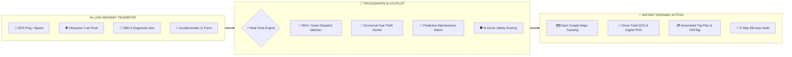

<div align="center">

```
  ████████╗██████╗ ██╗   ██╗ ██████╗██╗  ██╗███████╗ █████╗  █████╗ ████████╗██╗  ██╗██╗
  ╚══██╔══╝██╔══██╗██║   ██║██╔════╝██║ ██╔╝██╔════╝██╔══██╗██╔══██╗╚══██╔══╝██║  ██║██║
     ██║   ██████╔╝██║   ██║██║     █████═╝ ███████╗███████║███████║   ██║   ███████║██║
     ██║   ██╔══██╗██║   ██║██║     ██╔═██╗ ╚════██║██╔══██║██╔══██║   ██║   ██╔══██║██║
     ██║   ██║  ██║╚██████╔╝╚██████╗██║ ╚██╗███████║██║  ██║██║  ██║   ██║   ██║  ██║██║
     ╚═╝   ╚═╝  ╚═╝ ╚═════╝  ╚═════╝╚═╝  ╚═╝╚══════╝╚═╝  ╚═╝╚═╝  ╚═╝   ╚═╝   ╚═╝  ╚═╝╚═╝
```

### 🛰️ **THE AUTONOMOUS OPERATING SYSTEM FOR PAN-INDIA COMMERCIAL FREIGHT**
#### *Zero Downtime. Zero Fuel Pilferage. 100% Highway Dominance.*

<br/>

[](https://nextjs.org/)
[](https://www.typescriptlang.org/)
[](https://supabase.com/)
[](https://developers.google.com/maps)
[](https://tailwindcss.com/)
[](https://ihmcl.co.in/)
[](LICENSE)

<br/>

```
[LIVE TELEMETRY STREAM] 📡 FLEET STATUS: ACTIVE | 40-TON CORRIDOR: NH-48 | SYNC: 12ms | FASTag: ONLINE
```

<p align="center">
  <a href="#-the-mission">The Mission</a> •
  <a href="#-god-mode-capabilities">Capabilities</a> •
  <a href="#-high-octane-architecture">Architecture</a> •
  <a href="#-mission-control-modules">Modules</a> •
  <a href="#-legacy-vs-trucksaathi">Comparison</a> •
  <a href="#-ignite-the-engine-quickstart">Quickstart</a> •
  <a href="#-highway-code-india-compliance">India Compliance</a>
</p>

---

</div>

<br/>

## ⚡ The Mission: Taming the Beast of Indian Freight

India's freight highway corridors move **over 4.6 billion tonnes of cargo** every year across rough terrains, chaotic checkpoints, extreme heatwaves, and congested interstate toll plazas. Yet, 90% of transport fleets are run on greasy notebook ledgers, frantic midnight phone calls, and mysterious diesel disappearances.

**TruckSaathi is the antidote.** 

Built from the ground up as a **military-grade, real-time logistics control tower**, TruckSaathi turns raw GPS feeds, OBD-II sensor telematics, driver habits, and NHAI toll records into an intelligent autonomous copilot. From Kashmir to Kanyakumari, it manages your heavy vehicles like an air traffic control room.

> **"HORN OK PLEASE" meets Silicon Valley Artificial Intelligence.** 🚚💨

---

## 🔥 God-Mode Capabilities


```mermaid
flowchart LR
    subgraph SENSORS ["🛰️ LIVE HIGHWAY TELEMETRY"]
        A1[📡 GPS Ping / Speed]
        A2[⛽ Ultrasonic Fuel Float]
        A3[🔧 OBD-II Diagnostic Bus]
        A4[🛑 Accelerometer G-Force]
    end

    subgraph CORE ["🧠 TRUCKSAATHI AI CO-PILOT"]
        B1{⚡ Real-Time Engine}
        B2[🤖 95%+ Smart Dispatch Matcher]
        B3[🚨 Nocturnal Fuel Theft Hunter]
        B4[🔮 Predictive Maintenance Matrix]
        B5[🛡️ AI Driver Safety Scoring]
    end

    subgraph ACTIONS ["🎯 INSTANT HIGHWAY ACTION"]
        C1[🗺️ Dark Google Maps Tracking]
        C2[📱 Driver Field SOS & Digital POD]
        C3[💳 Automated Trip P&L & FASTag]
        C4[📑 E-Way Bill Auto-Audit]
    end

    SENSORS ==> CORE
    CORE ==> ACTIONS
```

### 🧠 1. AI Smart Dispatch Matrix (95%+ Match Confidence)
Forget guessing which truck can haul what load. The **Smart Dispatch Algorithm** dynamically calculates:
- Permissible GVW vs. cargo weight (blocks dangerous RTO overload penalties).
- Real-time engine health, brake wear, and battery status.
- Driver safety leaderboard ratings and hours-of-service fatigue scores.
- Highway corridor topography (Golden Quadrilateral, Western Dedicated Freight Corridor, etc.).

### ⛽ 2. Nocturnal Fuel Pilferage Hunter
Diesel theft is the silent killer of fleet profitability. TruckSaathi's telemetry engine detects:
- Sudden tank capacity drops (Liters & %) while ignition is switched **OFF**.
- Real-time KMPL fuel economy deviations against load tonnage.
- Instant audible warnings and red-zone telemetry alerts for fleet controllers.

### 🛡️ 3. Driver Safety & Telematics Black Box
- Real-time G-force monitoring: harsh braking, sudden lane whip, overspeeding, and jackrabbit acceleration.
- Automatic Driver Safety Index (0-100) dynamically ranking the fleet.
- Fatigue detection triggers safety reminders to stop at verified highway dhabas.

### 🔧 4. Predictive Breakdown Prevention
- Continuous wear metrics for **Brakes, Battery, Engine Thermals, and Tyre Tread Depth**.
- Service urgency index flags vehicles *before* a catastrophic axle snap on the ghats.

### 📑 5. India Logistics Sovereign Compliance
- **E-Way Bill Expiry Countdown:** Real-time sync with estimated arrival times; alerts dispatchers before GST fines strike.
- **Automated FASTag Toll Audits:** Direct ledger reconciliation of toll plaza charges with trip route corridors.
- **Digital Proof-of-Delivery (e-POD):** Mobile consignment consignee sign-off with instant image upload.

---

## 💻 Tech Stack Built for Pure Speed

```
  Frontend Core       ──► Next.js 16 (Turbopack Engine) + React 19 + TypeScript 5
  Real-Time Comms     ──► Supabase Edge WebSockets (Multi-Portal Subscriptions)
  Geospatial Engine   ──► Google Maps Platform (Custom Dark Vector Theme) + Dark OSM Fallback
  UI & Glassmorphism  ──► TailwindCSS + Framer Motion (60 FPS Micro-Interactions)
  Iconography         ──► Lucide Enterprise Industrial Vector Icons
  Data Stream Export  ──► Zero-Latency In-Memory CSV Stream Generator
```

---

## 🕹️ Mission Control Modules

| Route | Ops Module | Cyber Deck Functionality |
| :--- | :--- | :--- |
| [`/dashboard`](src/app/dashboard/page.tsx) | **Fleet Control Tower** | Pan-India live radar, active telemetry ticker, revenue counters, and critical alarms. |
| [`/ai-dispatch`](src/app/ai-dispatch/page.tsx) | **AI Dispatch Deck** | One-click ML matching between cargo orders, driver ratings, and vehicle chassis. |
| [`/trips`](src/app/trips/page.tsx) | **Trip Command** | Manifest generator, route waypoints, live status chips, and POD verification modals. |
| [`/vehicles`](src/app/vehicles/page.tsx) | **Asset Registry** | Heavy vehicle telemetry cards, RC/Insurance expiry timers, payload specs, and live stats. |
| [`/fuel`](src/app/fuel/page.tsx) | **Fuel Telematics** | Tank depth sensors, fuel curve graphs, KMPL benchmarks, and theft detection log. |
| [`/maintenance`](src/app/maintenance/page.tsx) | **Predictive Shop** | Component health degradation trackers (Brakes, Tyres, Battery, Engine) & bay booking. |
| [`/safety`](src/app/safety/page.tsx) | **Safety War Room** | Telemetry risk radar, overspeed incident logs, and driver safety leaderboards. |
| [`/expenses`](src/app/expenses/page.tsx) | **Trip P&L Ledger** | Commercial revenue vs. FASTag tolls, driver bata, fuel costs, and net margin ROI. |
| [`/driver-portal`](src/app/driver-portal/page.tsx) | **Mobile Pilot Deck** | Smartphone-optimized UI for drivers: one-tap Highway SOS, trip GPS, & e-POD camera bill upload. |
| [`/reports`](src/app/reports/page.tsx) | **Intelligence Hub** | Deep-dive CSV exporter for telematics, fuel logs, safety metrics, and financial audits. |

---

## ⚔️ Legacy Logistics vs. TruckSaathi

| Feature | Old-School Transport Office 👴 | TruckSaathi AI Copilot 🚀 |
| :--- | :--- | :--- |
| **Fleet Tracking** | *"Driver ko phone lagao"* (Calls ignored) | **Sub-second GPS telemetry & dark map tracking** |
| **Fuel Monitoring** | Fuel receipts on crumpled slips | **Ultrasonic tank level sensors + theft alerts** |
| **Maintenance** | Wait for smoke on the highway | **Predictive wear analytics & bay scheduling** |
| **Route Dispatch** | Gut feelings & scribbled notepads | **AI match engine (Payload, Health, Safety, Route)** |
| **Trip Financials** | Month-end ledger headache | **Real-time Trip P&L with FASTag toll sync** |
| **Highway Emergency** | Panic & hours lost on isolated roads | **Instant Mobile SOS panic beacon to dispatch** |
| **GST / E-Way Bill** | Risky expired bills stuck at RTO | **Auto-expiry countdown & overload prevention** |

---

## 🚀 Ignite The Engine (Quickstart)

### Prerequisites
Make sure you have **Node.js 18+** and **npm 9+** installed on your workstation.

```bash
# 1. Clone the repository
git clone https://github.com/sylbornfurtado19/TruckSaathi.git

# 2. Enter the cockpit
cd TruckSaathi

# 3. Install the dependencies
npm install

# 4. Configure your private environment variables
cp .env.example .env.local
```

### Environment Setup (`.env.local`)
Edit your `.env.local` file with your credentials:
```env
# Supabase Realtime Telemetry Sync
NEXT_PUBLIC_SUPABASE_URL=https://your-project.supabase.co
NEXT_PUBLIC_SUPABASE_ANON_KEY=your-anon-key

# Google Maps Platform (Maps JavaScript API)
NEXT_PUBLIC_GOOGLE_MAPS_API_KEY=your-restricted-google-maps-key
```

### Launch Mission Control
```bash
# Run the Turbopack high-speed dev server
npm run dev
```

Open `http://localhost:3000` in your browser and prepare to command your fleet.

---

## 🇮🇳 Highway Code: India Logistics Engine

TruckSaathi was custom-engineered to solve the hard realities of Indian transport:

```
  ┌────────────────────────────────────────────────────────────────────────┐
  │  🇮🇳  NATIONAL LOGISTICS SOVEREIGNTY PROTOCOL                         │
  ├────────────────────────────────────────────────────────────────────────┤
  │  ✔ NHAI FASTag Toll Reconciliation (Electronic Toll Collection)       │
  │  ✔ Parivahan / Vahan Payload Capacity Ceiling Compliance               │
  │  ✔ GST E-Way Bill Validity Hour-Glass Radar                           │
  │  ✔ Multi-State Permit & Fitness Certificate Reminders                 │
  │  ✔ Golden Quadrilateral & North-South Corridor Route Optimization      │
  └────────────────────────────────────────────────────────────────────────┘
```

---

## 🛡️ Security & Zero-Leak Architecture

- 🔒 **Zero Hardcoded Secrets**: Protected by automated scanning, `.gitignore` isolation, and domain HTTP referrer restrictions.
- 🛡️ **Role-Based Telemetry Access**: Role isolation between Super Admins, Fleet Managers, Dispatch Operators, and Drivers.
- 🌐 **Fail-Safe Offline Maps**: Seamless automatic fallback to dark OpenStreetMap if Google Maps quota or network drops on remote highways.

---

## 👑 The Architect

Crafted with high-voltage passion and code by:
<br/>

**[sylbornfurtado19](https://github.com/sylbornfurtado19)**  
📧 `sylbornfurtado19@gmail.com`  
*Engineering the future of commercial autonomous telemetry.*

---

<div align="center">

```
  ___ ___                      ________     __   __________.__                              
 /   |   \  ___________  ____  \_____  \   |  | _\______   \  |   _________    ______ ____  
/    ~    \/  _ \_  __ \/    \  /   |   \  |  |/ /|     ___/  | _/ __ \__  \  /  ___// __ \ 
\    Y    (  <_> )  | \/   |  \/    |    \ |    < |    |   |  |_\  ___/ / __ \_\___ \\  ___/ 
 \___|_  / \____/|__|  |___|  /\_______  / |__|_ \|____|   |____/\___  >____  /____  >\___  >
       \/                   \/         \/       \/                   \/     \/     \/     \/ 
```

**TruckSaathi Enterprise © 2026** • *Rule the Corridors. Deliver the Future.*

</div>
